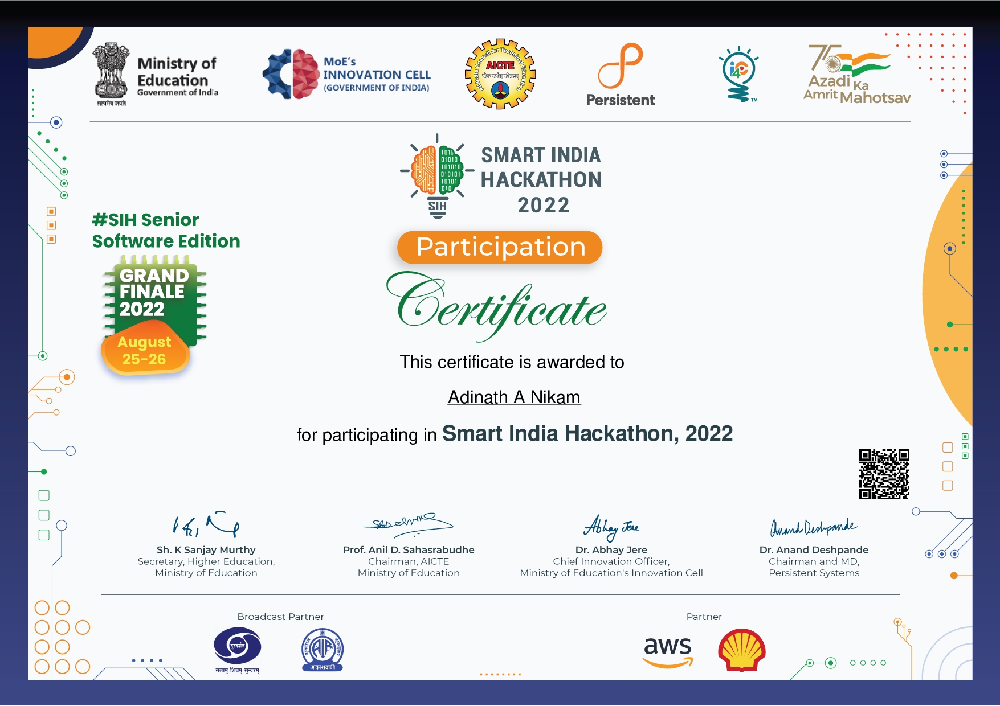

<p align="center"></p>

👽 Extraterrestrial

<p align="left">  </p>

<h2> 👨🏻‍💻 &nbsp;A Little Bit About Me and My Interests</h2>

```yaml
name: Adinath A Nikam
location: 127.0.0.1

education:
  [
    "Self-Taught Developer and Designer",
    "Bachelor's in Computer Science Engineering",
  ]
  

fields_of_interests:
  [
    "Hybrid Mobile Application Design and Development",
    "Data Engineering",
    "Web Design and Development",
    "UI/UX",
    "Cloud Application Development",
    "DevOps",
  ]
technical_background:
  [
    "Intern - Data Engineering at Nubax DataLabs",
    "Intern - Web Design and Development",
  ]
  
```


## Languages

<code></code>
<code></code>
<code></code>
<code></code>
<code></code>
<code></code>
<code></code>
<code></code>


<!-- ## My Stats

| <a href="https://github.com/adinath-nikam/github-readme-stats"></a> | <a href="https://github.com/adinath-nikam/github-readme-stats"></a> |
| ------------- | ------------- | -->


## Stats

|              |                                                                                                            |
| --------------------------------------------------------------------------------------------------------------------------------- | ----------------------------------------------------------------------------------------------------------------------------------------------------------------------------------------------------------------- |
|  |  |

## Hackathons

<p align="center"></p>

<h2> 📈 &nbsp;My GitHub History!</h2>


  
<p align="left">
  
</p>


### Regards

Adinath Nikam
