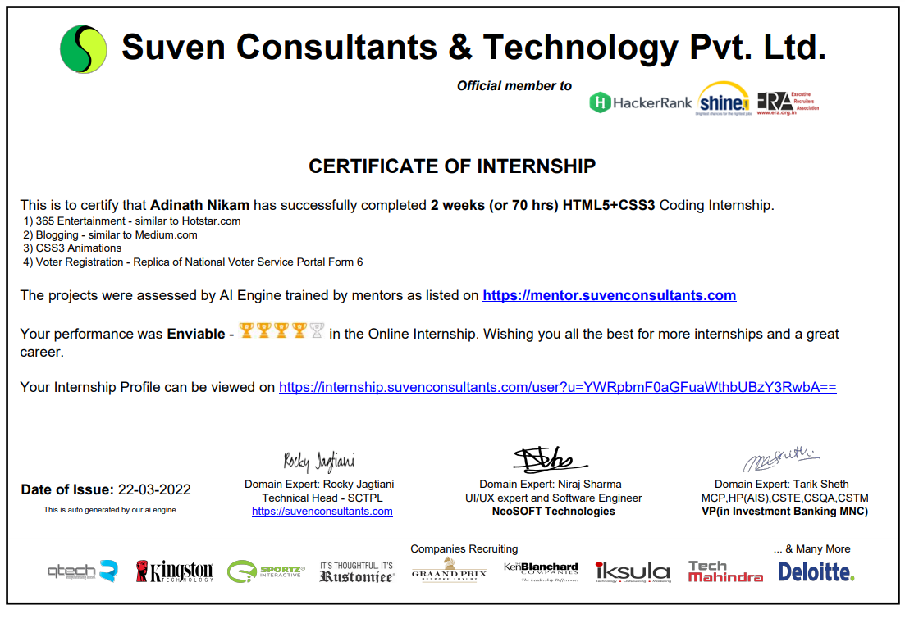
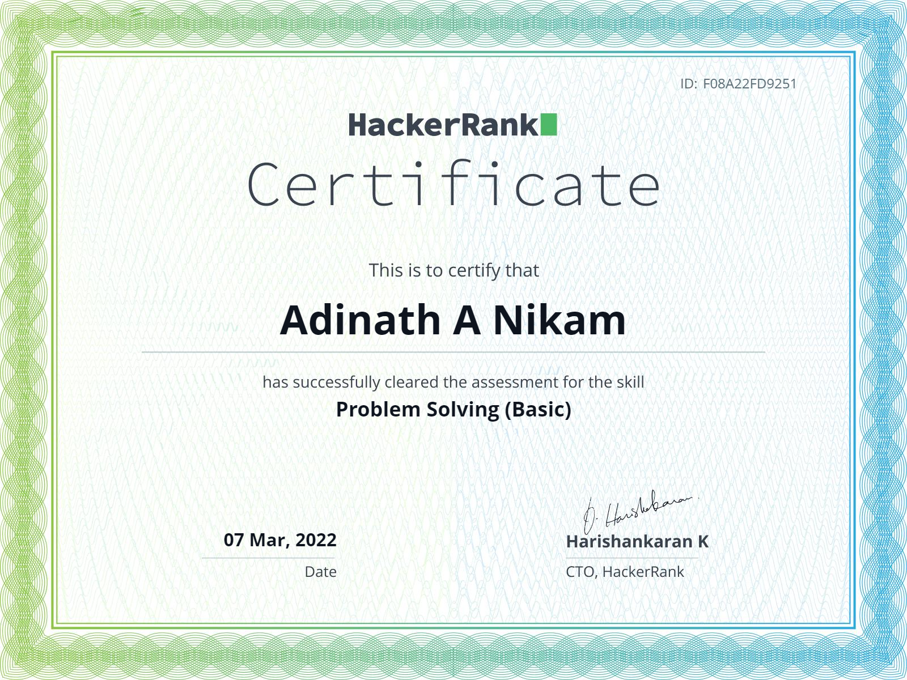
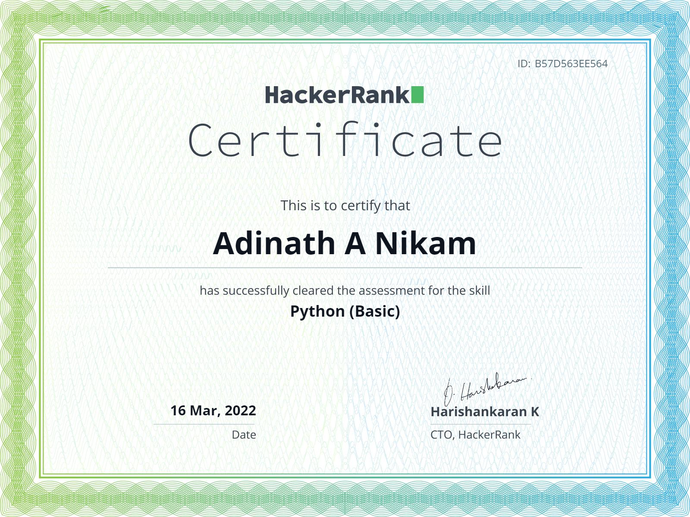
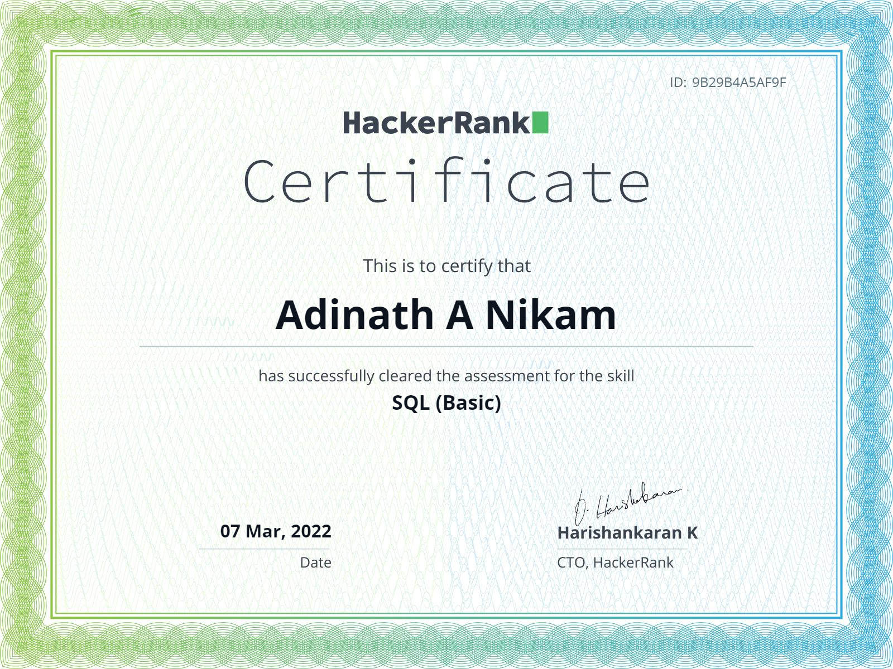

I ❤ Coding

## About Me

🌏 - INDIA - KA

❤️ - Front End With Flutter and Python

🖥 - Computer Science

💬 - Ask me about anything [here](https://github.com/adinath-nikam/adinath-nikam/issues)

## Languages

<code></code>
<code></code>
<code></code>

## Certifications

# (Internship) Suven Consultants Pvt. Ltd.

# Hackerrank

|  |  | 

## My Stats

|  |  |
| ------------- | ------------- |

### Regards

Adinath Nikam
